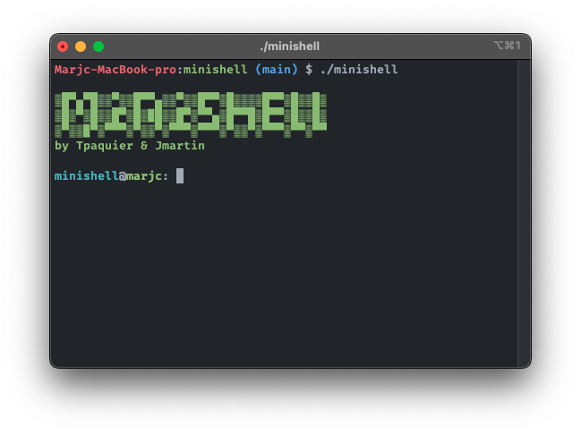

<h1 align="center">
     </br>
    Project n°8 - minishell
    <h4 align="center" style="width: 50%; margin: 2rem auto; font-weight: normal;"> 
    As beautiful as a shell. <br/> This project is about creating a simple shell.
    </h4>
</h1>

<p align="center">
    
</p`>

## Goals

This shell should:

- Display a prompt when waiting for a new command.
- Have a working history.
- Search and launch the right executable (based on the PATH variable or using a
relative or an absolute path).
- Not use more than one global variable. Think about it. You will have to explain
its purpose.
- Not interpret unclosed quotes or special characters which are not required by the
subject such as ``\`` (backslash) or ``;`` (semicolon).
- Handle ``’`` (single quote) which should prevent the shell from interpreting the meta-
characters in the quoted sequence.
- Handle ``"`` (double quote) which should prevent the shell from interpreting the meta-
characters in the quoted sequence except for ``$`` (dollar sign).
- Implement redirections:
    1. ``<`` should redirect input.
    2. ``>`` should redirect output.
    3. ``<<`` should be given a delimiter, then read the input until a line containing the delimiter is seen. However, it doesn’t have to update the history!
    4. ``>>`` should redirect output in append mode.
- Implement pipes (``|`` character). The output of each command in the pipeline is
connected to the input of the next command via a pipe.
- Handle environment variables (``$`` followed by a sequence of characters) which
should expand to their values.
- Handle ``$?`` which should expand to the exit status of the most recently executed
foreground pipeline.
- Handle ``ctrl-C``, ``ctrl-D`` and ``ctrl-\`` which should behave like in bash.
- In interactive mode:
    1. ``ctrl-C`` displays a new prompt on a new line.
    2. ``ctrl-D`` exits the shell.
    3. ``ctrl-\`` does nothing.
- Your shell must implement the following builtins:
    1. ``echo`` with option -n
    2. ``cd`` with only a relative or absolute path
    3. ``pwd`` with no options
    4. ``export`` with no options
    5. ``unset`` with no options
    6. ``env`` with no options or arguments
    7. ``exit`` with no options

## Allowd functions

readline, rl_clear_history, rl_on_new_line, rl_replace_line, rl_redisplay, add_history, printf, malloc, free, write, access, open, read, close, fork, wait, waitpid, wait3, wait4, signal, sigaction, sigemptyset, sigaddset, kill, exit, getcwd, chdir, stat, lstat, fstat, unlink, execve, dup, dup2, pipe, opendir, readdir, closedir, strerror, perror, isatty, ttyname, ttyslot, ioctl, getenv, tcsetattr, tcgetattr, tgetent, tgetflag, tgetnum, tgetstr, tgoto, tputs

## How to run

```shell
git clone https://github.com/MarJC5/minishell.git
cd minishell/
make
./minishell
```

Enjoy :^)
